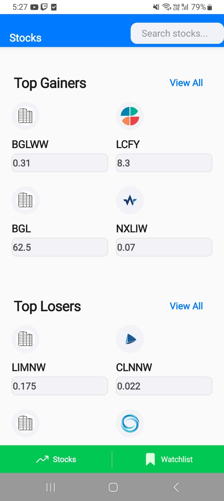
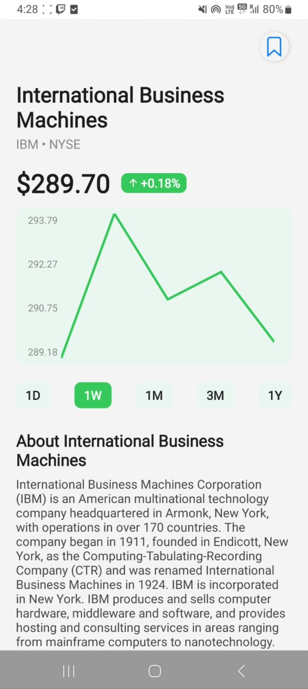
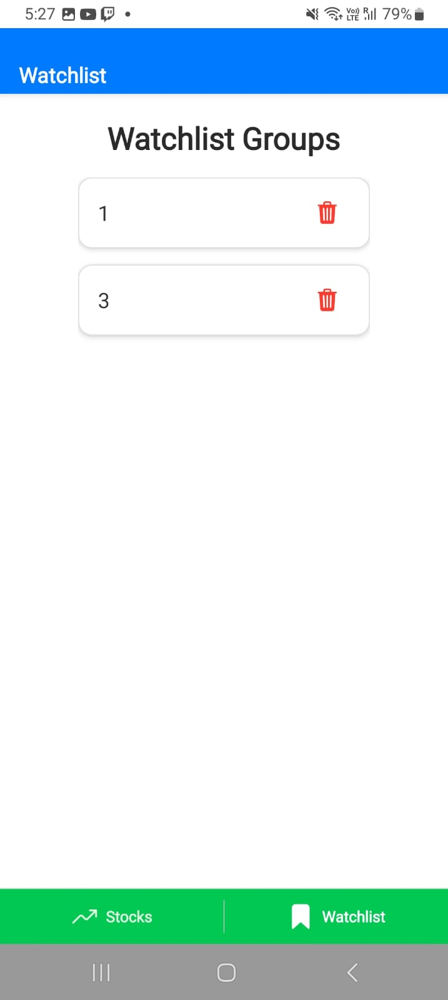

#React Native Stocks/ETFs Broking App

This is a feature-rich Android application for a stocks/ETFs broking platform, built with React Native and Expo. 
---

## 📱 Features Implemented

- **Tab Navigation**
  - Two main tabs: **Stocks (Explore)** and **Watchlist** using Expo Router .

- **Explore Screen (Stocks Tab)**
  - Displays Top Gainers and Top Losers sections, each as a grid of cards with stock/ETF information.
  - "View All" option for each section, leading to a paginated list of all gainers/losers.
  - Search Bar to browse through all the stocks .
- **Watchlist**
  - Shows all user-created watchlists and their stocks.
  - Empty state UI if no watchlists are present.
  - Ability to add new watchlists and manage stocks within them.

- **Product (Details) Screen**
  - Shows detailed information for a selected stock/ETF (company overview, price, etc.).
  - Displays a line graph of historical prices (using react-native-svg).
  - Add/remove stock to/from watchlist with a dynamic icon reflecting watchlist status.

- **Add to Watchlist Popup**
  - Allows users to add a stock to an existing watchlist or create a new one.
  - Watchlist data is persisted using AsyncStorage.

- **View All Screen**
  - Paginated list of all stocks in a section (gainers/losers), with loading and error handling.

- **API Integration**
  - Fetches data from [Alpha Vantage](https://www.alphavantage.co) endpoints:
    - Top Gainers and Losers (Alpha Intelligence)
    - Company Overview (Fundamental data)
    - Ticker Search (Core Stocks API)
    - Time search daily , weekly and monthly (line graph)
  - Handles API key, rate limits, and error states.

- **Caching**
  - API responses are cached with expiration using `@react-native-async-storage/async-storage` to optimize network usage and performance.
  - Watchlist groups are also cached for bookmarking the stocks.

---

## 🛠️ Libraries & Techniques Used

- **React Native** – Core framework for building native apps.
- **Expo** – Development and build tooling for React Native.
- **Expo Router** – File-based routing and navigation.
- **@react-native-async-storage/async-storage** – Persistent local storage for caching and watchlist management.
- **Alpha Vantage API** – Stock/ETF data provider (company overview, time series, search).
- **react-native-svg** – For rendering line graphs of stock prices.
- **Custom Error & Loading Handling** – User-friendly messages and spinners for all network states.
- **Dynamic Routing** – `[symbol]` and `[type]` routes for details and view-all pages.

---

## 🚦 How to Run

1. **Install dependencies**
   ```bash
   npm install
   ```
2. **Start the app**
   ```bash
   npx expo start
   ```
3. **Build for Android (AAB)**
   ```bash
   npm install -g eas-cli # if not already installed
   eas build -p android
   ```

---

## 📁 Project Structure

- `app/` – Main app source code (pages, API, components)
- `app/api/alphaVantage.js` – API and caching logic
- `app/(app)/index.tsx` – Main Explore screen
- `app/details/[symbol].tsx` – Dynamic details page
- `app/view-all/[type].tsx` – View all gainers/losers
- `app/(app)/watchlist.tsx` – Watchlist and groups
- `assets/` – Images and fonts

---

## 🖼️ Photos & Videos


**Example:**

| Explore Screen | Details Screen | Watchlist |
|---|---|---|
|  |  |  |

**Demo Video:**
- [App Walkthrough (Google Drive)](https://drive.google.com/file/d/17Lq1nnOTetpAo-_3qzNIKzFsXFEj0wB_/view?usp=drivesdk)


**APK Download:**
- [Download APK (Google Drive)](https://drive.google.com/file/d/17RSqkujaB7lKjfHL6Qn1EgjDYrN-iVlu/view?usp=drivesdk)
